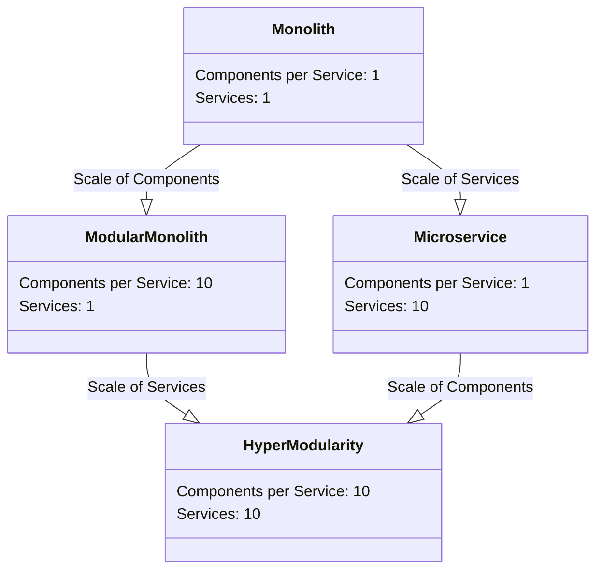

```mermaid
classDiagram
    class Monolith {
        Components per Service: 1
        Services: 1
    }

    class Microservice {
        Components per Service: 1
        Services: 10
    }

    class ModularMonolith {
        Components per Service: 10
        Services: 1
    }

    class HyperModularity {
        Components per Service: 10
        Services: 10
    }

    %% Positioning the Classes
    Monolith --|> Microservice : Scale of Services
    Monolith --|> ModularMonolith : Scale of Components
    ModularMonolith --|> HyperModularity : Scale of Services
    Microservice --|> HyperModularity : Scale of Components

    %% Styling
    class Monolith~1,1~
    class Microservice~1,10~
    class ModularMonolith~10,1~
    class HyperModularity~10,10~
```
