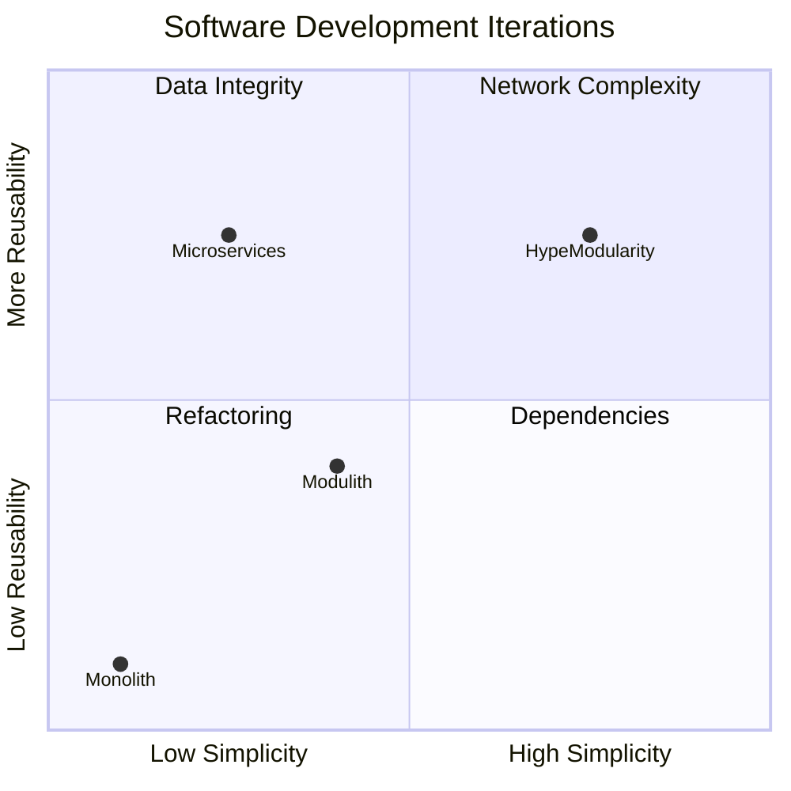

```mermaid
quadrantChart
    title Software Development Iterations
    x-axis Low Simplicity --> High Simplicity
    y-axis Low Reusability --> More Reusability
    quadrant-1 Network Complexity
    quadrant-2 Data Integrity
    quadrant-3 Refactoring
    quadrant-4 Dependencies
    Modulith: [0.4, 0.4]
    Monolith: [0.1, 0.1]
    Microservices: [0.25, 0.75]  
    HypeModularity: [0.75, 0.75]
```
