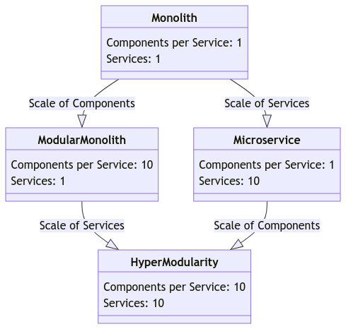
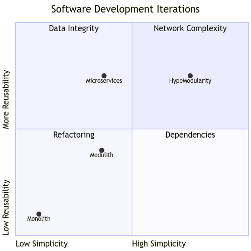

# [Modular Code by Hypermodularity](https://www.coders.info/)

From #clean ideas to code #smells ... Let's talk about The Pragmatic Development based on [HyperModularity](https://wiki.opensourceecology.org/wiki/Hypermodularity)

## Menu

+ [Hypermodular architecture](http://www.coders.info/#Hypermodular%20architecture)
+ [Hyperspecialization](http://www.coders.info/#Hyperspecialization)
+ [Hyperscaling](http://www.coders.info/#Hyperscaling)
+ [hypermodularity](http://www.coders.info/#hypermodularity)
+ [modular code](http://www.coders.info/#modular%20code)
+ [modular programming](http://www.coders.info/#modular%20programming)

+ [Adoption](http://www.coders.info/#Hypermodular%adoption)
+ [Reusability](http://www.coders.info/#Hypermodular%Reusability)

Popular Approach
+ SDLC today
+ Current Teamwork

Modular Approach
+ Modular SDLC
+ Modular Teamwork
  
  
## Code Expectations

### everyone expect:
  + [patterns](https://en.wikipedia.org/wiki/Software_design_pattern) - clean code
  + [SOLID](https://en.wikipedia.org/wiki/SOLID) – a set of 5 rules that should not be broken
  + [GRASP](https://en.wikipedia.org/wiki/GRASP) – General Responsibility Assignment Software Patterns (Principles), very general “good practices” for allocating responsibilities  
  + [KISS](https://en.wikipedia.org/wiki/KISS_principle)
  + ...
    

  
### no one expects the spanish inquisition
  

## Code Reality

+ [Legacy Code](https://en.wikipedia.org/wiki/Legacy_system)
+ [Spaghetti Code](https://en.wikipedia.org/wiki/Spaghetti_code)
+ [Code Smell](https://en.wikipedia.org/wiki/Code_smell)
+ ...

## Software Development

+ **software development** is the ongoing **refinement** of code to meet evolving service **requirements** and user **expectations**
+ **software development** is continuous **code improvement** for the implementation of **services** based on **requirements** resulting from changing **expectations**

## Single Responsibility with GRASP 
 
### Low Coupling on Design

#### Problem:
How to reduce the number of dependencies and the scope of changes, and increase the possibility
code reuse?

#### Solution:
Assign responsibility to limit the degree of coupling (number
object associations). Apply this principle at the design stage.

### High Cohesion

#### Problem:
How to make objects have a clear purpose, are understandable and easy to maintain?

#### Solution:
Assign responsibility to ensure consistency remains high.
Cohesion = "coupling" within one and the same class between its members.

## Single Responsibility with SOLID

#### SRP Single Responsibility Principle
A class has only one responsibility

#### OCP Open-Closed Principle
open to extensions, closed to modifications

#### LLSP
Liskov Substitution Principle
Each class object should be replaceable in the context of its use by an object of a child class

#### ISP Interface Segregation Principle
The client should not be forced to depend on methods he does not use

#### D DIP Dependency Inversion Principle
Higher level modules depend on abstraction, not implementation

## SDLC

That flowchart represents the software development life cycle with its stages and some of the units that need to be controlled at each stage. 

## Modular source code of network

In modular code of network, modular principles help by encouraging the development of concise, focused, and reusable modules that interact with well-defined interfaces, making the overall system robust and adaptable to changes.
Using these principles, developers are encouraged to pay attention to the bigger picture, strive to maintain consistency in code structure, and promote maintainability and scalability.
The concept of hypermodularity has been taken to the next level, where modularity is extremely pronounced, allowing for even greater flexibility, customization, interchangeability and scalability.

## Modular approach

Indeed, modern applications typically consist of multiple components that have been developed independently. 
The modular approach to development has several advantages and implications:

1. **Reusability:** Developers can use existing components or services for new applications, which saves time and resources. Open source libraries, frameworks, and APIs are examples of such reusable components.

2. **Microservices Architecture:** This architectural style structures an application as a collection of loosely coupled services, each implementing a specific business capability. This allows for independent development and deployment, which can improve the agility and scalability of applications.

3. **Third-Party Integration:** Modern applications often integrate third-party services such as payment gateways, authentication services (like OAuth providers), social media APIs, and more. These services provide rich features that developers can incorporate without having to develop them from scratch.

4. **Containerization and Orchestration:** Tools like Docker and Kubernetes facilitate the deployment of applications composed of multiple services. They handle the packaging, distribution, and management of applications in isolated environments, making it easier to handle complex applications.

5. **Continuous Integration/Continuous Deployment (CI/CD):** As applications consist of various components that are developed and updated independently, CI/CD pipelines are essential for automating the testing, integration, and deployment processes, ensuring that the application remains stable and that new features or fixes are rolled out swiftly and reliably.

6. **APIs and Service-Oriented Architecture (SOA):** The use of Application Programming Interfaces (APIs) has become a standard for facilitating communication between different components or services. SOA is an architectural pattern that allows services to communicate with each other, enabling the creation of large-scale distributed applications.

7. **Decoupling:** Having separate components means that they are decoupled, which can lead to better fault isolation. If one component fails, it does not necessarily bring down the entire application. Decoupled systems also facilitate easier updates and maintenance.

8. **Complexity Management:** While having independently developed components can increase modularity and flexibility, it also adds to the complexity of the system. Developers must manage the interactions between components carefully to ensure the system works as intended.

9. **Standardization and Protocols:** Standard communication protocols (such as HTTP/HTTPS), data-interchange formats (like JSON or XML), and architectural styles (REST, GraphQL) help independent components to interact without compatibility issues.

10. **Security Considerations:** As components may come from different sources and may be accessible over networks, there is a heightened focus on security. Secure communication, authentication, authorization, and regular security updates are crucial to protect the application from vulnerabilities.

11. **Dependency Management:** Applications built from independent components have to manage dependencies effectively. Package managers and tools are available for different programming languages and platforms to automate the handling of libraries and their updates.

12. **Monitoring and Logging:** To maintain such complex systems, robust monitoring and logging solutions are necessary. They provide insights into application performance and help in diagnosing issues when they arise.

13. **Cost and Vendor Lock-in:** Utilizing third-party services and cloud-based infrastructure can introduce cost considerations and potential vendor lock-in, where switching providers may become difficult due to dependencies on specific proprietary services or APIs.

14. **Interdisciplinary Teams:** Building and maintaining complex applications often requires interdisciplinary teams that can handle different aspects of the system, such as backend development, front-end interfaces, database management, and DevOps practices.

Overall, the trend towards assembling applications from independently developed components has indeed increased the complexity of development and operational processes. However, it also offers significant flexibility, scalability, and efficiency advantages. It's critical for development teams to adopt practices that manage complexity while harnessing the power of modular application design.

## Modular Values

+ Complexity
  + Network

+ Reusability
  + Interface    
  + Data
  + Logic

+ Specialization
  + Single responsibility

## Modular Requirements

#### System
+ **Modularity** is about the interaction between networks, rather than between components
  
#### Network
+ map of **Contextuality** - context of usage, interface is a part of environment not Logic or Data
+ manage **Complexity** is about network coverage to suit the customer's needs

### Component  
+ **Reusability** is possible when the interface, Data and Logic are separated and are not part of logic, the interface is adapted to the data and logic
+ **Specialization** is when code is responsible for the purpose of its existence

## Modular Architecture

+ **IaaC** - **Infrastructure as a Code** - Definition of Environment, Interface based on **MetaModules** and DevOps tools
+ **FaaS** - **Function as a Service** - logic and data models are used through the FaaS platform through DNS configuration: CNAME provieder, TXT configuration

Network is created thorugh connected Components betwen its Interfaces

## Modular Interface

An interface, in the context of software development, is defined as a shared boundary across which two separate components of a computer system exchange information. The concept of an interface can be applied in various contexts within software development:

1. **Webservice/API:** This refers to a set of rules and specifications that a software system can follow to communicate with other software systems. It defines the methods and data formats that should be used for interacting with the service over the internet or a network. These are often described in specifications such as OpenAPI for RESTful services or WSDL for SOAP services.

    - **Expected Input:** It usually consists of an endpoint, parameters (e.g., query parameters, headers, request body), and the request method (e.g., GET, POST, PUT, DELETE).
    
    - **Expected Output:** The output is typically a response including a status code (e.g., 200 OK, 404 Not Found), headers, and a body that contains the data being returned, which is often in a standardized format like JSON or XML.

2. **OOP Interface:** In object-oriented programming, an interface is a defined set of methods that a class can implement. Unlike a class, an interface does not contain any implementation details itself—it only defines method signatures. When a class implements an interface, it agrees to provide implementations for all the methods declared by the interface.

    - **Expected Input:** The input refers to the parameters that the methods of the interface accept. These must be provided when invoking a method.

    - **Expected Output:** The output is the return type specified by each method in the interface. Implementing classes must return the appropriate type when the method is called.

Interfaces are critical because they provide a contract that a component, class, or service must follow, ensuring that any other component, class, or service that interacts with it knows exactly what to expect in terms of inputs and outputs, regardless of the internal implementation. This standardization simplifies the process of integrating different software components, as developers only need to understand the interface to use the functionality provided.

In both cases, adhering to a standardized definition of interfaces helps ensure interoperability, promotes loose coupling, and enhances the reusability of components across different systems. It also makes it easier to perform unit testing and to develop components in parallel since interfaces can be mocked or stubbed out for testing purposes.

## Modular Application

Applications are growing in size and functionality and software quality is improved by splitting them into modules.
Separated piece then becomes one element of the modular architecture, each piece should be isolated by interface:

+ components - we are using in the context Network of Source Code
  + modules - inside the **component** as unit of code
  + plugins - outside the **component** as part of system, environment, platform
  
A module is simply a unit of code that you can "plug" into Platform

A component can be used in the system as:
+ package in npm, nuget
+ application in a web network or standalone

An Interface can be described by Standardized definition of expected input and output Data
+ webservice, API
+ OOP Interface
  
Modular applications are composed of modules.
That module can be not efficient with wrong practice, etc.., but the architecture of an application can be observed by checking the dependencies among all its modules.
So in the next iteration of implementation, the not efficeint module can be replaced.

## Modular vs OOP Application

Rewriting messy, interconnected traditional object-oriented applications to give them a good modular design is a hard task. 
To start designing any application in a modular way, we are talking about a modular network of components or infrastructure that will allow you to build more reliable applications and avoid a lot of manual bookkeeping.

## Modular Design

Modular design begins in an environment where the architecture cannot slowly decay and become unsustainable unnoticed.
If you create a new dependency between two parts of a modular application, you need to perform several explicit gestures to configure this dependency.
This can't happen by accident.
While this is not a cure for sloppy designs, it is an environment that encourages thoughtful design.

Modularity provides systems with a clearer design and control over module interdependencies; it also gives developers more flexibility in maintenance.
Take this into account when starting a new project – regardless of the initial scope of the project.
The modular design will have huge benefits for the architecture of the entire application as it will evolve from scratch.
The real benefits of modular programming may not be apparent in the first version of the application.
But they will become obvious later, as development costs for subsequent versions are reduced.

## Microservices and Modularity

Modular software architecture limiting the risk of creeping coupledness (also known as tight coupling) by enforcing boundaries between components and requiring them to interact through well-defined Application Programming Interfaces (APIs). 

Here are some ways in which modular software achieves this:

1. **Encapsulation:** Each module encapsulates its functionality, hiding its internal workings from other modules. Other components interact with the module through its API, which is the only exposed interface, thus reducing the risk of dependencies on internal structures or behaviors.

2. **Contract-Based Design:** When modules communicate through APIs, they adhere to a contract that specifies what inputs are expected and what outputs should be provided. This contract ensures that as long as the API's contract is maintained, changes within one module do not adversely affect others.

3. **Versioning:** When an API changes in a way that breaks backward compatibility, proper versioning helps to ensure that dependent components can continue to operate. This allows developers to update and improve their modules without immediately forcing all other components to adapt.

4. **Loose Coupling:** Loose coupling is a design principle aimed at reducing the interdependencies among components of a system, making them easier to replace, modify, and scale independently. API contracts play a critical role in maintaining this loose coupling by serving as a stable point of interaction.

5. **Dependency Inversion Principle:** This principle, part of the SOLID principles for object-oriented design, suggests that high-level modules should not depend on low-level modules; both should depend on abstractions (e.g., interfaces). Abstractions should not depend on details; details should depend on abstractions. This principle applies well to the notion of API contracts as a form of abstraction.

6. **Interface Segregation Principle:** Another of the SOLID principles, it states that a client should never be forced to depend on interfaces it does not use. This principle drives the design of focused API contracts that serve specific purposes without unnecessary coupling to unrelated functions.

7. **Interoperability:** Even when different modules are implemented in different programming languages or run on different systems, a clear API contract allows them to work together seamlessly. This makes it easier to integrate and replace components as needed.

By adhering to these principles and using well-defined API contracts, modular software can grow and evolve with reduced risk of becoming a tangled, tightly coupled system that is hard to understand, maintain, and scale. It also aids in the division of labor among development teams, as different teams can work on different modules simultaneously, with clear boundaries and interfaces between their respective pieces of the application.

## Modular Principles

It emphasizes the key attributes of modules in a modular code network, including being concise, focused, reusable, and having well-defined interfaces that enhance robustness and adaptability.
+ [Modular programming](https://en.wikipedia.org/wiki/Modular_programming)

### Environment
+ **management** over **creation**
+ **requirements** over **expectations**

### Source-code LOGIC
+ **reusability** over code **development**
+ **writing** over **refactoring** code
+ **Specialization** Over **Complexity**

### Data
+ data **standardization** first
+ **fat-data** over **fat-logic**

### Interface
+ GUI layer
+ Data Access layer
+ Protocol communication

## Refactoring

| Components per Services | 1                | 10               |
|-------------------------|------------------|------------------|
| 1                       | Monolith         | Microservice     |
| 10                      | Modular Monolith | Hyper Modularity |

### [Networks] of Infrastructure
Quantity of Components on Network Infrastructure
+ [Components] per Infrastructure
+ Components per [Services]

## Software Development Iterations

1. **Simplicity**: It provides a straightforward, single-tiered development and deployment model, which can be easier to manage, test, and deploy, especially for smaller applications or teams.

2. **Low Reusability**: The tightly coupled nature of the components means that they are often not designed to be reusable as independent services or modules. Changes in one area can have ripple effects throughout the application, making it difficult to isolate components for reuse in different contexts.

While this traditional approach to software design has its advantages, especially when starting a new project or working within a small team, it may not offer the flexibility and scalability provided by more modular architectures. As applications grow, a monolith can become challenging to maintain, and organizations may look to refactoring toward more modular or microservice-oriented architectures to increase maintainability and enable easier reuse of components.

### Simplicity

Simplicity in software development typically refers to designing and implementing systems that are easy to understand, maintain, and modify. The concept of simplicity touches upon several aspects of software engineering, including the design, the code, the architecture, and even the user interface. Here are some key elements that reflect simplicity in software development:

1. **Ease of Understanding:** A simple system is one that developers can easily comprehend. The easier it is for a new developer to understand how a system works, the simpler the system is considered to be.

2. **Clean and Readable Code:** Code that is straightforward, well-commented, and adheres to consistent coding standards is easier to read and understand, which contributes to the overall simplicity of the system.

3. **Minimalistic Design:** A design that achieves the desired outcomes with the least amount of complexity and the fewest components necessary is considered simple. This involves avoiding over-engineering and unnecessary features (YAGNI – You Aren't Gonna Need It).

4. **Modularity:** Breaking down the system into clearly defined, cohesive, and loosely coupled modules can make it simpler by allowing developers to focus on one piece of the system at a time without needing to understand the entire codebase.

5. **Ease of Maintenance:** Simple systems are easier to maintain and fix since the complexity is minimized, making it easier to isolate issues and implement changes.

6. **Straightforward Architecture:** An architectural style that is intuitive and obvious without complex dependencies or interactions between components often reflects simplicity.

7. **Ease of Testing:** Simpler systems are often easier to test because their behaviors are more predictable, and there are fewer edge cases to consider.

8. **Ease of Deployment:** The simpler the deployment process, the fewer steps required, and the less room there is for errors, which contributes to overall system simplicity.

9. **Documentation:** Good documentation can greatly contribute to perceived simplicity by making it clear how to use the system and how it works internally.

10. **Avoiding Premature Optimization:** Resisting the urge to optimize before it's clear that performance is an issue helps maintain simplicity. Premature optimization can introduce unnecessary complexity.

11. **User Interface Design:** For end-user software, simplicity can also mean creating an interface that is intuitive to use without extensive training or documentation.

In essence, simplicity in software development is about minimizing complexity at all levels. It's a guiding principle that can lead to software that is robust, efficient, cost-effective to maintain, and adaptable to change. It aligns well with several principles of software design such as KISS (Keep It Simple, Stupid), Occam's Razor (preferences for simplicity in problem-solving), and the aforementioned YAGNI.

### High simplicity and low reusability

High simplicity and low reusability in software development often refer to practices or structures that are easy to understand and work with but are difficult to extract for use in different contexts or projects. 
Here are some examples:

1. **Monolithic Applications:**
   A single-tiered, self-contained application with all components integrated into a cohesive unit. Due to tight coupling, components aren't typically reusable in other systems.

2. **Scripting and Automation Scripts:**
   Simple scripts written to perform one-off tasks or automate specific workflows. They're usually written quickly for a particular use case and lack the generalization needed for reuse.

3. **Single-use Libraries or Classes:**
   Custom libraries or classes designed to solve a specific problem in a specific context. They're not intended or architected for broader reuse outside of their original application.

4. **Inline Code:**
   Code written inline without modular functions or classes, often seen in smaller or less complex scripts. This code is directly tied to its context and thus has low reuse potential.

5. **Hardcoded Configurations:**
   Settings or configuration values hardcoded within the application code. This approach is simple, but it ties the configuration closely to the specific deployment, making reuse in different environments or for different instances of the applications difficult.

6. **Procedural Code:**
   Procedural or imperative programming without significant abstraction. The straightforward approach may be simple in its readability and understanding but can result in code that's less modular and harder to reuse as stand-alone components.

7. **Non-generic Algorithms:**
   Algorithm implementations that are highly specialized for a particular kind of data or problem and are not designed to be adapted easily for other purposes.

8. **Standalone Desktop Applications:**
   Applications that are specifically designed for a single user or a specific task and are not necessarily built with component reusability in mind.

9. **Flat File Processing:**
   Simple flat file processing scripts or routines that perform operations on a specific file structure without any abstraction to handle different file formats or structures.

10. **Proof of Concept (PoC) Code:**
    Code written during an exploratory phase of development for the purpose of demonstrating a concept. PoCs are often quick and dirty implementations that aren't meant to be reusable.

These examples emphasize simplicity in their designs or implementations, aiming to get the job done with minimal overhead. However, as they are often tailored for specific scenarios and may lack the abstraction or modularity required for reuse, they exhibit low reusability. As systems scale or needs evolve, developers often refactor such code to increase modularity and reusability while trying to retain as much simplicity as possible.

## Expected Outcomes

Hypermodular design principle of creating complex systems from smaller, easily managed, interchangeable and often standardized parts or modules, offers more of flexibility, customization, interchangeability, and scalability.
By following the modular design principles, developers should aim for the larger framework by ensuring the code structure remains consistent and the product becomes maintainable and scalable.

A monolith that serves many services does not strictly adhere to the microservices architectural style, since the core principle of microservices is that they are independent and loosely coupled. 

However, in practical scenarios, especially during the evolution of a system from a monolithic architecture to microservices, you might have a hybrid situation where a monolithic application interacts with or serves multiple microservices.

In such a setup, the monolith and the microservices might interact in any number of ways – the monolith could be an entry point that routes requests to various microservices, or it could invoke microservices to handle specific tasks. 

This transitional or mixed state can be referred to using several terms:

1. **Hybrid Architecture:** This term is commonly used to describe a system that has characteristics of both monolithic and microservices architectures. It features a core monolithic application that is complemented by a set of microservices.

2. **Modular Monolith:** If the monolith has been refactored internally to have modular components that are somewhat similar to microservices but are not independently deployable, it might be termed a modular monolith. 

3. **Layered Monolith:** Sometimes, the monolithic application may serve as a layer (such as the presentation layer or business logic layer) and calls the microservices that represent other layers (such as data access or specialized services).

4. **Monolith as a Microservices Client:** In this pattern, the monolithic application acts similarly to any other external client that consumes microservices.

5. **Monolithic Gateway or BFF (Backend for Frontend):** When the monolith handles client connections and simply forwards requests to the appropriate microservices (often while handling concerns like authentication and logging), it may be referred to as a gateway or a "backend for frontend".

6. **Orchestrator:** If the monolith is managing the workflow or business process that involves calling multiple microservices in a certain order to fulfill a higher-level business function, it can be seen as an orchestrator.

It's worth noting that there is no strict technical term for a monolith that serves many microservices since it represents a state that often exists during a migration towards a more microservice-centric architecture, which most organizations tend to see as temporary. However, in some cases, if the monolith serves its purpose efficiently and offers good maintainability, performance, and scalability, the organization might deliberately choose to continue with a hybrid approach long-term.

## Benefeits

Modular programming offers several benefits for developers, such as reducing code complexity and size, enhancing modularity and cohesion, increasing reusability and portability, and facilitating collaboration and communication.

#### Make your code readable and easy to understand

Modular programming separates code into functions, each of which deals with a single aspect of overall functionality. It eliminates unnecessary code and makes your app much lighter and easy to understand.

#### Improves code accessibility and sharing

Splitting related code into a single file or library rather than keeping it as a monolithic code improves code accessibility and sharing. Thus, during app development, teammates can quickly access what they are looking for.

Modular programming enables developers to create conventions for file names and location by following specific folder structures, it simplifies navigation through the source code making it a lot easier to look into the specific API, UI, or any other core functionality.

#### Easy to test

The modular programming approach simplifies code testing, as writing tests for small functions is less complicated. 
Also, the test is much more detailed, which means if anyone doesn’t understand the function or a block of code, they can get a clear idea from the test about what is going under the hood.

#### Reduces the chances of bugs

Modular programming minimizes the risk of programming errors. As each block of code acts as a single source of truth, it makes it easier to spot errors in the code. 
Even while updating the code for bug fixes, developers need to update only specific functions in the module and everything that uses the function will automatically get updated.

#### Easy code refactoring

Refactoring is a way to restructure internal code without changing its external functionality. 
It seems too time-consuming if you don’t have modular code. Modularising software code reduces refactoring workload in the long run.

## What Hypermodularity is?

Hypermodularity refers to specialized modularity to design configurable systems, products, technologies or processes.
The more modules there are, the more combinations we have at our disposal. The increase in the number of modules forces their specialization.

Hypermodularity is not about writing, but about reusing code in a network of dependencies

Hypermodularity shifts the burden of programming:
+ from development to management
+ from programming to defining services based on available source-code and data

## How?

Modular programming is a software design approach that focuses on breaking down programs into independent, interchangeable modules where each contains everything necessary to execute a specific functionality. This separation simplifies complex systems, makes the code easier to manage, and promotes code reuse. 

Here’s how each of the mentioned principle fits into modular programming:

### 1. Management over Creation
   - **Why to Use:** The emphasis on management rather than **creation** ensures that codebases are well-organized and easy to navigate, making the development process more efficient and faster.
   - **How to Use:** Use a clear modular structure in which each module has one responsibility. Organize code repositories and document each module's functionality and interfaces. This helps with future management and scaling of the source-code base.

### 2. Requirements over Expectations
   - **Why to Use:** Prioritizing requirements ensures that the modules developed will meet the actual needs of the users or system, instead of being based on developers' assumptions or expectations that may not align.
   - **How to Use:** Start with a comprehensive **requirements** analysis and use it to define the scope and design of each module. Make sure you create test cases based on **requirements** rather than expectations to verify that the module works as expected.

### 3. Reusability over Code Development
   - **Why to Use:** Focusing on reusability can significantly reduce development time and effort, as well as reduce the risk of errors because well-tested modules can be reused rather than rebuilt.
   - **How to Use:** Design modules with generality and loose coupling in mind. Create tool libraries, follow standard interfaces, and use design patterns for easy reuse. Make sure that the module does not depend heavily on a specific context or other modules.

### 4. Writing over Refactoring Code
   - **Why to Use:** Writing code correctly from the start reduces the need for extensive refactoring later, which can be resource-intensive and risky if it leads to unforeseen problems.
   - **How to Use:** The goal here is to not refactor, but build small part of logic and replace them instead of refactor, which cost more resources. It not mean to spend more time in the design and planning phase, but adapting and prototyping continuously instead of spending time on definition the ideal requirements. Write simple, clean and understandable code and include reviews and pair programming to detect potential problems early. The Pair programming with ML generators of course. To build or find the logic, adopt, test & deploy.

### 5. Specialization Over Complexity
   - **Why to Use:** Specializing in a particular area or function allows a system or team to excel, delivering higher quality and more efficient outcomes than trying to handle too many varied tasks. This principle can improve performance, enhance focus, and reduce the risks associated with attempting to navigate excessively complex domains or projects.
   - **How to Use:** Identify core competencies or essential functions and design systems, modules, or team roles around these specific areas. Avoid feature creep that leads to bloated, complex solutions. Concentrate on developing expertise and excellence in a narrower field, which can then be integrated with other specialized systems or roles to create a comprehensive solution.
     

### 6. Data Standardization First
   - **Why to Use:** Standardization simplifies data exchange between modules and systems, promotes interoperability, and reduces complexity when scaling or integrating with other systems.
   - **How to Use:** Define clear protocols, data formats and interfaces from the beginning. When possible, stick to well-accepted industry standards and ensure that all modules comply with specific data standards.

### 7. Fat-Data over Fat-Logic
   - **Why to Use:** This principle encourages the creation of data structures with rich information content, reducing and moving the logical functions to interfaces and middleware
   - **How to Use:** Design your data models to be comprehensive and include all necessary information. This approach often favors object-oriented designs, where data and related behaviors are combined into objects. Divide objects into data models that do not contain method functions and those that contain them but do not have attributes, i.e. data. Separation of data from functions facilitates expansion and does not create artificial dependencies. For [Object-oriented programming](https://en.wikipedia.org/wiki/Object-oriented_programming), [Single-responsibility principle](https://en.wikipedia.org/wiki/Single-responsibility_principle) and [Dependency injection](https://en.wikipedia.org/wiki/Dependency_injection) will be helpful. That Principle reduce abstraction in logic area by using objects instead of (no)typed data. The main advantage is that it allows logical code to be reused in other contexts throught the interfaces of data.

## Modular development

The technique of modular programming emphasizes splitting computer programs into independent, interchangeable modules. These modules contain everything essential to execute a single aspect of software functionality.

+ By breaking down code into smaller, more manageable sections, it becomes easier to understand, debug, and test. 
+ Modules can be reused in different projects or contexts, and can be easily adapted or replaced if needed. 
+ Modules can also be developed, maintained, and documented separately, allowing for smoother integration when combined.

Modular programming aims to ease software development and maintenance by breaking larger programs into smaller parts. It makes the software development consistent, faster, and flexible.

+ Expectations describing
+ Requirements:
  + **Interface** between Components, Communication layer
    + **Data Model** input/output definition
      + expected **Values** for Data Model inputs and outputs
        + **Logic** Code finding, generating, customizing

As you can see, the code is generated only at the end, as in the TDD "Test-driven development" principals, because before that you need to define the expected input and output data to verify that the logic performs the expected result on the input data

## Modular Component

Components promote reusability, modularity, and maintainability, and are integral to modern software architecture design.
Modular component is a modular unit with a specific role, designed to be executed within a particular environment, providing an interface that mediates between its internal logic/data handling and the broader system. 

It possesses the following characteristics:

### 1. Environment
The environment encompasses the necessary settings and platform under which the component operates. It includes the infrastructure, runtime system, necessary services, and configuration that enable the component to function efficiently and interact with the system or other components. An effective environment ensures that the component is isolated from complexities, allowing the core functionality to be the primary focus.

### 2.1 Interface
The interface is the point of contact or boundary across which the component communicates with external entities. It provides a clear definition of how other components can interact with it, specifying:
    
### 2.1.1 Logic
This aspect of the interface describes the behavior or the operations that the component performs. It contains the executable part of the component, such as algorithms, business rules, and decision-making processes. The logic determines how the component processes input and generates output.

### 2.1.2 Data
This aspect of the interface defines the types and structures of the data that the component accepts as input and produces as output. It lays down the schema, data formats, and communication protocols to ensure that the data exchange between components is consistent and understandable, thereby allowing for proper integration and interoperability within the system.

## Modular network

The smallest element of a modular network is a component.
The component can be defined as a self-contained unit with a well-specified functionality that can be integrated into a larger system. 
The component one running service that can be written or reused thanks to successive modular building blocks of reusable code.

This is the hyper modular network of code ...

+ [ModularComponents.mp4](ModularComponents.mp4)

## Hypermodular SDLC

Hyper-modular development emphasizes the use of highly reusable, encapsulated code modules that can be configured and connected through dependencies to create complex systems.
In this paradigm, rather than writing extensive new code, developers focus on integrating existing modules, each providing a specific piece of functionality that can be independently developed, tested, and maintained.

In this flowchart, each node represents a step or unit of control within the hyper-modular development process:

- **Planning**: Establishes the necessary requirements and assesses the inventory of available modules, mapping out the needed dependencies for the project.
- **Integration**: Involves selecting suitable modules, configuring dependencies between them, and conducting integration tests to ensure the modules work well together.
- **Iteration**: Iterations are shorter and more flexible, focusing on updating modules based on feedback, while improving performance and handling any technical debt.
- **Deployment**: The configured system is deployed to a staging environment for final verification before being released into production.
- **Maintenance**: Ongoing monitoring of the system, tracking issues, and refining individual modules occur post-deployment.

This methodology streamlines the development process, prioritizing composition over custom development, and made possible by advances in package managers and the widespread availability of software modules.

## How to design modular code?

Designing modular code involves following a set of steps and principles.
By following steps and principles, you can design modular code that is maintainable, scalable, testable, and promotes collaboration among developers.

1. Identify components: Start by identifying the main components or features of your application. These can be functionalities like user authentication, data manipulation, or external integrations. Understanding the different components will help in breaking down the code into smaller, manageable modules.

2. Define interfaces and contracts: For each component, define clear interfaces and contracts that specify the inputs, outputs, services offered, and services required. This helps in establishing a clear boundary between modules and ensures that they interact in a predictable manner.

3. Encapsulate implementation details: Hide internal data and logic from other modules by encapsulating implementation details. Expose only necessary information and methods through the defined interfaces. This enables other modules to interact with a module without knowing its internal workings.

4. Minimize coupling: Reduce the dependencies between modules to minimize coupling. Coupling refers to the level of interdependence between modules. A high level of coupling can make the codebase rigid and difficult to maintain. To minimize coupling, only expose essential functionalities from one module to another.

5. Maximize cohesion: Aim for high cohesion within each module. Cohesion refers to the degree to which the responsibilitieswithin a module are related and focused. A highly cohesive module focuses on a single responsibility and performs a well-defined set of tasks. This makes the module easier to understand, test, and maintain.

6. Break down modules into smaller units: If a module becomes too large or complex, consider breaking it down into smaller, more manageable units. This promotes reusability and makes the codebase more flexible.

7. Consider scalability and reusability: When designing modules, think about how they can be scaled or reused in different contexts. Design modules in a way that allows for easy extension and adaptation to future requirements. This can involve designing modules with flexibility in mind or creating generic modules that can be used in various projects.

8. Testability: Ensure that each module can be tested independently by defining clear interfaces and contracts. Write unit tests for each module to verify its behavior in isolation.

9. Document and communicate: Document the purpose, responsibilities, and interfaces of each module. This documentation helps other developers understand how to use and interact with the modules. Additionally, communicate and collaborate with your team to ensure everyone understands the modular design and can effectively work with it.

It's important to follow a consistent coding style and naming convention, as well as use comments and documentation to explain the purpose and functionality of each module. Furthermore, a version control system and testing framework can help manage and verify the changes and updates of your code. Finally, you should consider using a modular architecture and design pattern that suit your application's needs and goals such as layered, microservices, plugin, or event-driven architectures, and singleton, factory, observer, or mediator patterns.

## How to refactor non-modular code?

Refactoring non-modular code into modular code can be an intensive process that requires careful planning and execution. 
Here’s a guide to help you through it:

1. **Assessment**:
   - Carry out a thorough review of the existing codebase.
   - Identify areas of high complexity, tightly coupled components, and duplicated logic.

2. **Establishing Refactoring Goals**:
   - Define clear goals for refactoring, such as increasing maintainability, improving scalability, or preparing the code for new feature development.

3. **Planning**:
   - Create a detailed plan outlining the specific parts of the codebase to refactor.
   - Break the work into smaller, manageable tasks.
   - Prioritize tasks based on dependencies, potential impact, and complexity.

4. **Understanding Dependencies**:
   - Map out the dependencies between different parts of the codebase.
   - Identify “seams” in the code where changes can be made with minimal impact on other parts.

5. **Creating Tests**:
   - Before making changes, ensure that there are adequate tests around the existing code (Unit Tests, Functional Tests).
   - If tests do not exist, start by writing tests for the current logic to ensure you can detect any changes in behavior during the refactoring.

6. **Refactoring Iteratively**:
   - Begin with small, incremental changes, ideally refactoring one module, class, or even method at a time.
   - Continuously run tests to ensure refactoring doesn’t break existing functionality.

7. **Modularizing Code**:
   - Extract tightly coupled logic into separate, more cohesive and loosely coupled modules.
   - Apply principles such as DRY (Don’t Repeat Yourself) to eliminate repetitions and Single Responsibility Principle to ensure each module has one reason to change.

8. **Review API and Data Flow**:
   - Define clear interfaces for each module so they can interact without internal knowledge of each module's workings.
   - Establish data flow mechanisms that support the modularity of the codebase.

9. **Continuous Integration**:
   - Frequently merge changes into the main codebase to prevent drift and reduce the potential for difficult integration conflicts.

10. **Documentation and Knowledge-Sharing**:
    - Document architectural decisions, module interfaces, and the rationale behind the changes to help future maintainers.
    - Communicate changes regularly with your team to sync up and gather input from different perspectives.

11. **Monitoring and Optimization**:
    - Keep an eye on the impact of refactoring on system performance and resource usage.
    - Make adjustments as necessary to optimize the code after refactoring.

12. **Reflect and Adapt the Process**:
    - After completing a set of refactoring tasks, reflect on what worked well and what could be improved.
    - Adjust the refactoring strategy based on feedback and lessons learned to enhance future iterations.

Remember that the exact steps may vary depending on the specific codebase and the context in which you’re operating. Phases might overlap, and the process could be recursive as you learn more about the code and uncover additional areas that require attention. The key is to maintain the existing functionality while making the codebase more modular, readable, maintainable, and ready for future changes.

## Modular Teamwork

Modularity is a mechanism to coordinate the work of many people around the world, manage interdependencies between their parts of the project, and assemble very complex systems in a reasonably reliable way

## Modular Management

Managers who want to capitalize on hypermodularization's and hyperspecialization's possibilities need to learn how best to divide knowledge work into discrete tasks, recruit specialized workers, ensure the quality of the work, and integrate the pieces into a final whole through Engineering platform
Meanwhile, companies and governments must be aware of the potential perils of this new age: "digital sweatshops" and other forms of worker exploitation; nefarious schemes hidden behind task atomization; work that becomes dull and meaningless; increased electronic surveillance of workers.

## Modular Platform 

+ Management of network components
+ Component implementation
  

### Component Implementation in the Network

#### (Interface) definition with Human
+ Input Data definition based on requirements
+ Output Data Generation for test purpose

#### (Module) Testing with Human, based on above requirements
+ steps scenario preparation with data input and outputs

#### (Module) Development in Platform
+ based on the above data, reuse, generate or create the code its first iteration manually or with AI

#### (Module) Deployment and Testing in Environment
+ first iteration and go back if not works

#### Implementation (In Network of Modules)
+ first imeplmentation and reimplement, when is ready to work (tested and deployed)

## Tools?

+ Opensource [moduleTool](https://moduletool.github.io/docs/)
+ Online free tool, one package from documentation per one day [one day run](https://www.onedayrun.com)
+ Online tool with with marketplace 20EUR/month with autodeployment [hypermaton](https://www.hypermaton.com)

## Where?

+ hypermodular solutions, examples, use cases on [hypermodular.com is a blog about the hypermodular world](http://www.hypermodular.com)

## How to learn more about modular programming?

To learn more about modular programming, you can read books and articles about its theory and practice, such as
"Modular Programming with Python" by Erik Westra or "The Art of Modular Programming" by David H. Marlow.
You can also watch videos and courses that demonstrate modular programming concepts and techniques, such as
"Modular Programming in Java 9" by Koushik Kothagal or "Python 3: Project-Based Python, Algorithms, Data Structures" by Andrea Dumitrescu. 

Additionally, you can practice and experiment with modular programming by creating your own projects or joining existing ones on online platforms and communities such as GitHub, CodePen or Stack Overflow.

+ more about [HyperModularity](https://www.hypermodularity.com/) in draft of book

+ [Modular Monoliths Video - Simon Brown](https://www.youtube.com/watch?v=5OjqD-ow8GE).
+ [Majestic Modular Monliths - Axel Fontaine](https://www.youtube.com/watch?v=BOvxJaklcr0).
+ [Monolithic application - Wikipedia](https://en.wikipedia.org/wiki/Monolithic_application).
+ [Modular Monolith with DDD - GitHub repository](https://github.com/kgrzybek/modular-monolith-with-ddd).
+ [Vertical Slice Architecture - Jimmy Bogard](https://jimmybogard.com/vertical-slice-architecture/).

## Author

+ Hyper Modules Developer [Tom Sapletta](https://tom.sapletta.com/) 

  
---

+ [edit](https://github.com/coders-info/www/edit/main/README.md)
+ [project](https://github.com/coders-info/)
